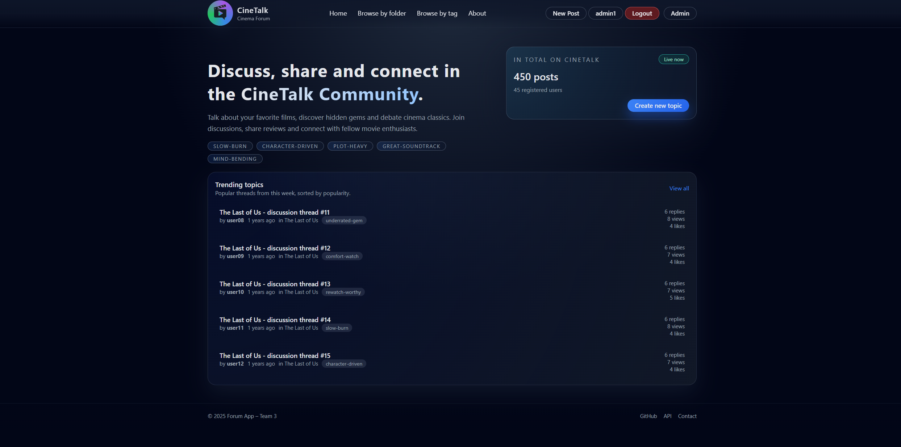
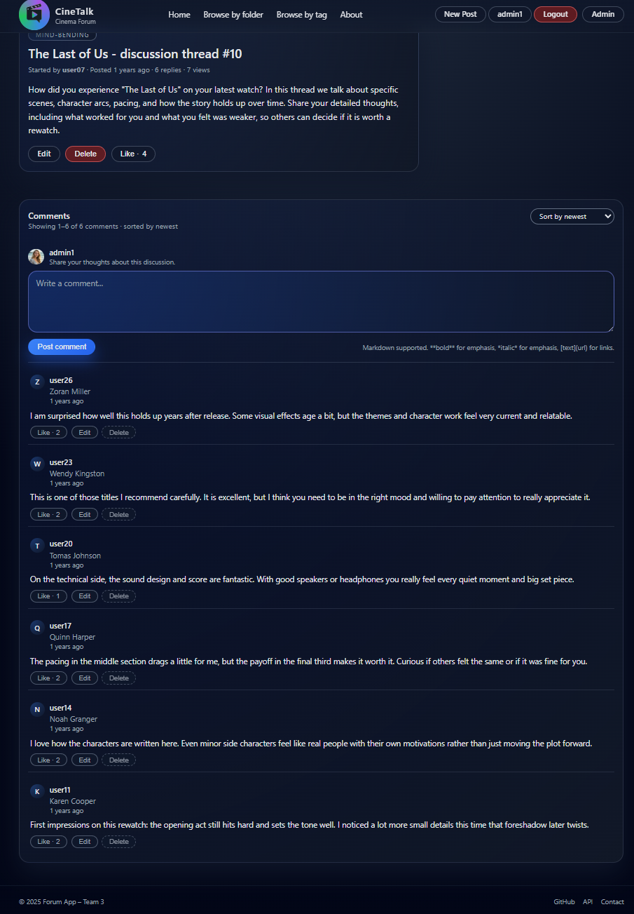
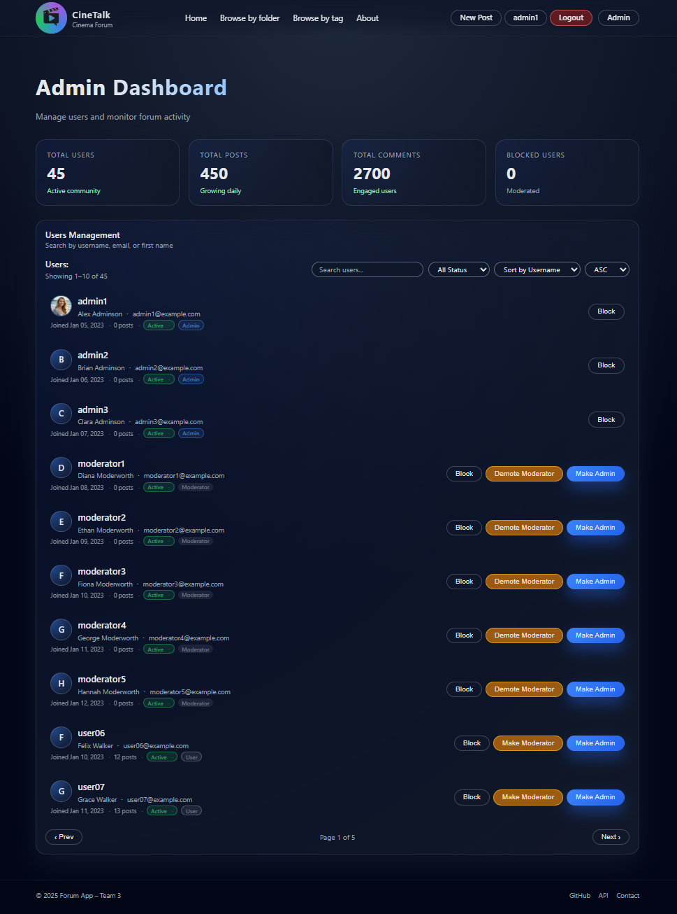
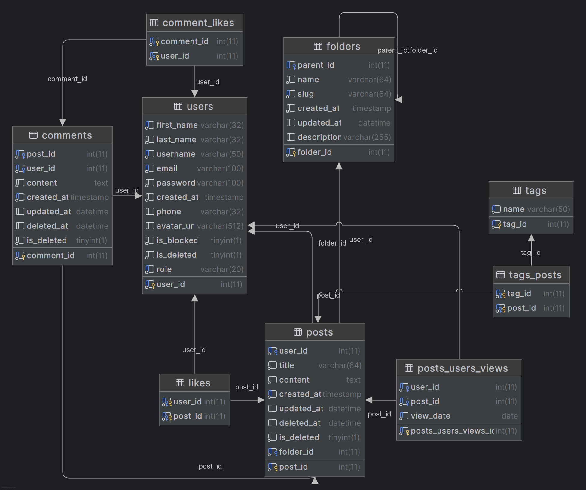

# CineTalk Forum System

[](https://www.oracle.com/java/)
[](https://spring.io/projects/spring-boot)
[](https://jwt.io/)
[](https://mariadb.org/)

A comprehensive movie and series discussion forum built with Spring Boot, featuring user authentication, hierarchical folder organization, Markdown-formatted posts and comments, and multi-role administrative controls. Developed as part of Telerik Academy A72 Web Development Program by Team 3.

## Table of Contents

- [What This Project Does](#what-this-project-does)
- [Screenshots](#screenshots)
- [Database Schema](#database-schema)
- [Key Features](#key-features)
- [Technology Stack](#technology-stack)
- [Architecture](#architecture)
- [Security](#security)
- [Getting Started](#getting-started)
- [Default Users](#default-users)
- [API Documentation](#api-documentation)
- [REST API Quick Start](#rest-api-quick-start)
- [Project Structure](#project-structure)
- [Performance & Limits](#performance--limits)
- [Testing](#testing)
- [Contributors](#contributors)
---

## What This Project Does

This is a full-featured movie and series discussion forum that allows users to:
- Register and log in with secure JWT authentication
- Create, read, update, and delete posts with **Markdown formatting** organized in hierarchical folders (Movies/Series)
- Comment on posts with Markdown support and interact through likes
- Tag posts for easy discovery and filtering (e.g., "mind-bending", "rewatch-worthy", "character-driven")
- Browse content through a hierarchical folder structure (Root → Movies → [The Matrix, Inception, ...])
- Upload custom profile avatars (5MB max, stored locally)
- Track post views and see trending content based on unique daily views
- Multi-role access control (Admin, Moderator, User) with granular permissions
- Manage users and content (admin/moderator features)

The application provides both a web interface (Thymeleaf) and a REST API for programmatic access, with OpenAPI/Swagger documentation.

---

## Screenshots

> **Note:** Screenshots can be added by running the application and saving images to the `docs/images/` folder.
>
> **Quick Start**: Login with username `admin1` and password `12345678` to access all features for screenshots.

### Home Page / Forum Posts
The main forum interface displays posts organized by folders (Movies/Series), with filtering options by tags, search functionality, and sorting capabilities (by date, likes, or views). Shows trending posts and hierarchical folder navigation.



### Post Detail Page
Individual post view showing Markdown-formatted content, comment thread with nested replies, like counts, view tracking, and user interactions. Demonstrates the responsive design and social features.



### Admin Dashboard
Administrative interface for managing users across three roles (Admin/Moderator/User). Features include blocking users, deleting accounts, promoting roles, and monitoring content with moderation tools.



### Edit Profile
Profile management with avatar upload support (5MB max).


---

## Database Schema



**Key Schema Features:**
- **Soft Deletes**: Posts, comments, and users use `is_deleted` flags to preserve data integrity
- **View Tracking**: Unique daily views per user tracked in `posts_users_views` for trending calculations
- **Hierarchical Folders**: Self-referential `parent_id` allows nested folder structures
- **Many-to-Many**: Posts-Tags and User-Likes relationships
- **Cascading Deletes**: Deleting a post cascades to comments, likes, tags, and views
- **Immutable Username**: Database trigger prevents username changes after creation
- **Blocked User Protection**: Triggers prevent blocked users from creating posts/comments

---

## Key Features

- **User Management**: Registration, login/logout, user profiles, multi-role access (Admin/Moderator/User)
- **Authentication**: JWT-based authentication with HTTP-only cookies and BCrypt password hashing
- **Markdown Support**: Full Markdown rendering for post content and comments using flexmark-all library
- **Avatar Upload**: Custom profile avatars with 5MB file size limit, stored locally in `uploads/avatars/`
- **Posts**: Create, edit, delete posts with titles, Markdown content, tags, and folder assignment
- **Comments**: Add Markdown-formatted comments to posts with edit/delete capabilities
- **Social Features**: Like/unlike posts and comments
- **Folder Organization**: Hierarchical folder structure with slug-based navigation (e.g., `/forum/folders/movies/inception`)
- **Tags**: Tag posts (up to 3 tags per post), filter by tags (e.g., "mind-bending", "rewatch-worthy")
- **View Tracking**: Unique daily view tracking per user to identify trending posts
- **Search & Filter**: Search posts by title, filter by tags, sort by date/likes/views
- **Admin Dashboard**: User management (block, delete, promote roles), content moderation
- **Soft Delete**: Non-destructive deletion with restore capability for posts, comments, and users
- **Pagination**: All lists paginated for performance
- **OpenAPI/Swagger**: Interactive API documentation at `/swagger-ui.html`

---

## Technology Stack

### Backend
- **Java 17** - Programming language
- **Spring Boot 3.5.7** - Application framework
- **Spring Data JPA** - Data persistence with Hibernate ORM
- **Spring Security** - Authentication and authorization
- **JWT (jjwt 0.12.3)** - Token-based authentication
- **MariaDB** - Relational database
- **Lombok** - Boilerplate code reduction
- **Gradle** - Build automation

### Libraries & Extensions
| Library | Version | Purpose |
|---------|---------|---------|
| **flexmark-all** | 0.64.8 | Markdown parsing and rendering for posts/comments |
| **springdoc-openapi** | 2.8.14 | OpenAPI 3.0 documentation and Swagger UI |
| **thymeleaf-extras-springsecurity6** | 3.1.2 | Thymeleaf integration with Spring Security |
| **thymeleaf-layout-dialect** | - | Layout support for Thymeleaf templates |

### Frontend
- **Thymeleaf** - Server-side HTML templating
- **jQuery 3.7.1** - JavaScript library
- **Custom CSS** - Styling

### Testing
- **JUnit 5** - Unit testing
- **Mockito** - Mocking framework
- **Spring Boot Test** - Integration testing support

---

## Architecture

The application follows a **layered architecture** pattern with clear separation of concerns:

**Presentation Layer**:
- MVC Controllers (Thymeleaf) for web interface at `/forum`, `/auth`, `/admin`
- REST Controllers (JSON API) for programmatic access at `/api/*`

**Business Logic Layer**:
- Service classes handle business rules, authorization checks, and transaction management
- Services validate operations and ensure users can only modify their own content (or admins can moderate)

**Data Access Layer**:
- JPA Repositories abstract database operations
- Custom repository implementations for complex queries (JPQL and native SQL)

**Database Layer**:
- MariaDB with relational schema
- Entities: User, Post, Comment, Folder, Tag, PostView (view tracking)
- Relationships: Many-to-many for likes and tags, one-to-many for posts/comments, self-referential for folder hierarchy

**Security Layer** (cross-cutting):
- JWT authentication filter validates tokens on every request
- Spring Security manages authorization with role-based access control
- BCrypt encrypts passwords

**Key Design Patterns**:
- Repository Pattern for data access
- Service Layer Pattern for business logic
- DTO Pattern for API data transfer
- Soft Delete Pattern for non-destructive deletion
- Builder Pattern (Lombok) for object construction

---

## Security

The application implements several security measures:

- **JWT Authentication**: Stateless authentication using JSON Web Tokens
- **BCrypt Password Hashing**: Passwords encrypted with BCrypt (work factor: 10)
- **HTTP-Only Cookies**: JWT stored in HTTP-only cookies for web app (prevents XSS)
- **Role-Based Access Control**: USER and ADMIN roles with different permissions
- **Input Validation**: Bean Validation (JSR-380) on all DTOs
- **SQL Injection Protection**: JPA parameterized queries
- **Authorization Checks**: Service layer validates user permissions (owner or admin)
- **Soft Delete**: Maintains data integrity and audit trails

**Note for Production**:
- Enable HTTPS and set `secure` flag on cookies
- Store JWT secret in environment variables (not properties files)
- Add rate limiting for login endpoints
- Enable CSRF protection for web forms

---

## Getting Started

### Prerequisites

- Java 17 or higher
- MariaDB 10.6+ or MySQL 8.0+
- Gradle (wrapper included)
- IDE with Lombok support (IntelliJ IDEA, Eclipse, or VS Code)

### Environment Setup

Before running the application, ensure Java is properly configured:

**Windows:**
1. Verify Java 17 is installed: Open Command Prompt and run `java -version`
2. If Java is not found, set JAVA_HOME:
   - Find your Java installation (typically `C:\Program Files\Java\jdk-17` or similar)
   - Open System Properties → Environment Variables
   - Add new System Variable:
     - Variable name: `JAVA_HOME`
     - Variable value: `C:\Program Files\Java\jdk-17` (your actual Java path)
   - Add to Path: `%JAVA_HOME%\bin`
   - Restart your terminal/PowerShell

**Linux/Mac:**
```bash
# Add to ~/.bashrc or ~/.zshrc
export JAVA_HOME=/usr/lib/jvm/java-17-openjdk  # or your Java path
export PATH=$JAVA_HOME/bin:$PATH
```

**Verify setup:**
```bash
# Windows (Command Prompt)
echo %JAVA_HOME%

# Windows (PowerShell)
echo $env:JAVA_HOME

# Linux/Mac
echo $JAVA_HOME

# All platforms - should show Java 17
java -version
```

### Installation

1. **Clone the repository**
```bash
git clone <repository-url>
cd forum-system
```

2. **Create the database**
```sql
CREATE DATABASE forum_db CHARACTER SET utf8mb4 COLLATE utf8mb4_unicode_ci;
```

3. **Run database migrations**

The SQL files are migrations that must be executed in order. Run all schema migrations first, then all seed data migrations:

```bash
# Run schema
mysql -u your_username -p forum_db < src/main/resources/db/schema.sql

# Run seed data
mysql -u your_username -p forum_db < src/main/resources/db/seed-forum.sql
```

**Note**: Dev versions of the db are separated by migration version. If you run the dev scripts, make sure you run each
migration v1-v2-v3-v4-v5 in order.
Each migration builds on the previous one. Skipping files or running them out of order will cause errors.

**Migration Summary**:
- **schema_v4.sql**: Migrates `is_admin` boolean to `role` enum (ADMIN/MODERATOR/USER)
- **schema_v5.sql**: Adds `description` field to folders table
- **seed-forum-v6.sql**: Seeds 30 movie/series folders, 45 users (3 admins, 5 moderators, 37 users), 450 posts, 2700 comments

4. **Configure application secrets**

Create `src/main/resources/application-secrets.properties`:
```properties
# Database Configuration
spring.datasource.url=jdbc:mariadb://localhost:3306/forum_db
spring.datasource.username=your_username
spring.datasource.password=your_password

# JWT Configuration
jwt.secret=your_secret_key_at_least_256_bits
jwt.expiration=86400000
```

5. **Run the application**
```bash
# Using Gradle wrapper (Windows)
gradlew.bat bootRun

# Using Gradle wrapper (Linux/Mac)
./gradlew bootRun
```

The application will start on http://localhost:8080

### Accessing the Application

**Web Interface**:
- **Home**: http://localhost:8080/forum
- **Login Page**: http://localhost:8080/auth/login
- **Register Page**: http://localhost:8080/auth/register
- **Admin Dashboard**: http://localhost:8080/admin (admin/moderator only)
- **User Profile**: http://localhost:8080/profile

**API Documentation**:
- **Swagger UI**: http://localhost:8080/swagger-ui.html (Interactive API testing)
- **OpenAPI JSON**: http://localhost:8080/v3/api-docs
- **REST API Base**: http://localhost:8080/api/

### API Authentication

For REST API access, include the JWT token in the Authorization header:
```
Authorization: Bearer <your_jwt_token>
```

Get a token by logging in via `/api/auth/login`:
```bash
curl -X POST http://localhost:8080/api/auth/login \
  -H "Content-Type: application/json" \
  -d '{"username":"admin1","password":"12345678"}'
```

The response will include a JWT token:
```json
{
  "token": "eyJhbGciOiJIUzI1NiJ9...",
  "username": "admin1",
  "role": "ADMIN"
}
```

---

## Default Users

The seed data (seed-forum-v6.sql) provides 45 test users for immediate access to the application. All users share the same password for testing purposes.

### Test User Accounts Summary

**Total Users**: 45 users across 3 role levels

| Role | Count | User IDs | Example Usernames |
|------|-------|----------|-------------------|
| **ADMIN** | 3 | 1-3 | `admin1`, `admin2`, `admin3` |
| **MODERATOR** | 5 | 4-8 | `moderator1`, `moderator2`, `moderator3`, `moderator4`, `moderator5` |
| **USER** | 37 | 9-45 | `user06`, `user07`, `user08`, ..., `user42` |

**Default Password (all users):** `12345678`

### Quick Access Accounts

| Username | Email | Role | Use Case |
|----------|-------|------|----------|
| `admin1` | admin1@example.com | **ADMIN** | Full admin access, user management, content moderation |
| `moderator1` | moderator1@example.com | **MODERATOR** | Content moderation capabilities |
| `user06` | user06@example.com | **USER** | Standard user, post/comment creation |

> **Security Note:** These are test accounts only. In production, change all default passwords immediately and use strong, unique passwords for each account.

### User Roles & Permissions

**ADMIN Role** (`admin1`, `admin2`, `admin3`):
- All MODERATOR and USER permissions (below)
- Access to Admin Dashboard at `/admin`
- Block/unblock users (prevents posting and commenting)
- Delete users (soft delete with restore capability)
- Promote users to any role (ADMIN/MODERATOR/USER)
- Delete any user's posts and comments (content moderation)
- View blocked and deleted users
- Bypass authorization checks (can edit/delete any content)

**MODERATOR Role** (`moderator1` - `moderator5`):
- All USER permissions (below)
- Access to Admin Dashboard at `/admin` (limited features)
- **Edit and delete** posts from regular users (USER role only)
- **Edit and delete** comments from regular users (USER role only)
- **Cannot** edit/delete content from other moderators or admins (protection against abuse)
- Cannot block users or change user roles (admin-only)

**USER Role** (Standard Users - `user06` through `user42`):
- Register new account at `/auth/register`
- Create, edit, and delete own posts with Markdown formatting
- Comment on posts with Markdown and edit/delete own comments
- Like/unlike posts and comments
- Tag posts (up to 3 tags per post)
- Upload profile avatar image (5MB max)
- Browse posts by folder, search by title, filter by tags
- View post details with view tracking (unique daily views)
- View user profiles
- Cannot post or comment when blocked by admin/moderator

### User Registration Requirements

When registering new users, the following validation rules apply:

**Username:**
- 4-50 characters long
- Must start with a letter (A-Z, a-z)
- Can contain letters, numbers, dots (.), underscores (_), and hyphens (-)
- Must be unique (case-sensitive)
- Cannot be changed after registration (immutable)

**Password:**
- Stored using BCrypt hashing (work factor: 10)
- Minimum requirements enforced by application (typically 8+ characters)

**Email:**
- Valid email format required
- Must be unique across all users
- Format: `username@domain.tld`

**Name:**
- First name: 4-32 characters
- Last name: 4-32 characters

**Phone (Optional):**
- Up to 32 characters
- Not validated for format

**Example Registration:**
```bash
# Via REST API
curl -X POST http://localhost:8080/api/auth/register \
  -H "Content-Type: application/json" \
  -d '{
    "username": "johndoe",
    "password": "SecurePass123!",
    "email": "john@example.com",
    "firstName": "John",
    "lastName": "Doe",
    "phone": "555-0100"
  }'
```

---

## API Documentation

The application provides a comprehensive REST API documented with OpenAPI 3.0. The Swagger UI interface allows you to explore and test all endpoints interactively.

### Accessing API Documentation

- **Swagger UI**: http://localhost:8080/swagger-ui.html
- **OpenAPI Spec (JSON)**: http://localhost:8080/v3/api-docs

### Available API Endpoints

#### Authentication (`/api/auth`)
- `POST /api/auth/register` - Register new user
- `POST /api/auth/login` - Login and receive JWT token
- `POST /api/auth/logout` - Logout (clears session)

#### Posts (`/api/posts`)
- `GET /api/posts` - Get all posts
- `GET /api/posts/paginated` - Get paginated posts with filters (searchQuery, orderBy, direction, tagId)
- `POST /api/posts` - Create new post (requires auth)
- `GET /api/posts/{postId}` - Get post by ID
- `PUT /api/posts/{postId}` - Update post (requires auth, owner or admin)
- `DELETE /api/posts/{postId}` - Soft delete post (requires auth, owner or admin)
- `POST /api/posts/{postId}/restore` - Restore deleted post (requires auth, owner or admin)
- `POST /api/posts/{postId}/like` - Like a post (requires auth)
- `DELETE /api/posts/{postId}/like` - Unlike a post (requires auth)

#### Comments (`/api/comments`)
- `GET /api/posts/{postId}/comments` - Get all comments for a post
- `POST /api/posts/{postId}/comments` - Create comment (requires auth)
- `PUT /api/comments/{commentId}` - Update comment (requires auth, owner or admin)
- `DELETE /api/comments/{commentId}` - Soft delete comment (requires auth, owner or admin)
- `POST /api/comments/{commentId}/like` - Like a comment (requires auth)
- `DELETE /api/comments/{commentId}/like` - Unlike a comment (requires auth)

#### Folders (`/api/folders`)
- `GET /api/folders` - Get all folders
- `GET /api/folders/{folderId}` - Get folder by ID
- `GET /api/folders/{folderId}/posts` - Get posts in folder (paginated)
- `POST /api/folders` - Create folder (requires admin)
- `PUT /api/folders/{folderId}` - Update folder (requires admin)
- `DELETE /api/folders/{folderId}` - Delete folder (requires admin, must be empty)

#### Tags (`/api/tags`)
- `GET /api/tags` - Get all tags
- `GET /api/tags/{tagId}` - Get tag by ID
- `POST /api/tags` - Create tag (requires auth)
- `PUT /api/tags/{tagId}` - Update tag (requires admin)
- `DELETE /api/tags/{tagId}` - Delete tag (requires admin)

#### Users (`/api/users`)
- `GET /api/users` - Get all users (requires admin)
- `GET /api/users/{userId}` - Get user by ID
- `PUT /api/users/{userId}` - Update user profile (requires auth, owner or admin)
- `POST /api/users/{userId}/avatar` - Upload avatar (requires auth, owner only)

#### Admin (`/api/admin`)
- `POST /api/admin/users/{userId}/block` - Block user (requires admin)
- `POST /api/admin/users/{userId}/unblock` - Unblock user (requires admin)
- `POST /api/admin/users/{userId}/promote` - Promote user role (requires admin)
- `DELETE /api/admin/users/{userId}` - Delete user (requires admin)

### Common Query Parameters

**Pagination & Filtering** (available on paginated endpoints):
- `page` - Page number (default: 1)
- `searchQuery` - Search posts by title
- `orderBy` - Sort field: `date`, `likes`, `views` (default: `date`)
- `direction` - Sort direction: `asc`, `desc` (default: `desc`)
- `tagId` - Filter by tag ID (default: 0 = all)

### Response Format

All API responses follow a consistent JSON format:

**Success Response**:
```json
{
  "postId": 1,
  "title": "Inception - discussion thread #01",
  "content": "How did you experience \"Inception\" on your latest watch?...",
  "author": {
    "userId": 9,
    "username": "user06",
    "firstName": "Felix"
  },
  "folder": {
    "folderId": 5,
    "name": "Inception",
    "slug": "inception"
  },
  "tags": ["mind-bending"],
  "likeCount": 4,
  "viewCount": 12,
  "commentCount": 6,
  "createdAt": "2023-03-02T20:00:00",
  "isDeleted": false
}
```

**Error Response**:
```json
{
  "timestamp": "2025-12-07T10:30:00",
  "status": 404,
  "error": "Not Found",
  "message": "Post with id 999 not found",
  "path": "/api/posts/999"
}
```

---

## REST API Quick Start

Here's a complete workflow demonstrating the API:

### 1. Register a New User

```bash
curl -X POST http://localhost:8080/api/auth/register \
  -H "Content-Type: application/json" \
  -d '{
    "username": "newuser",
    "password": "SecurePass123!",
    "email": "newuser@example.com",
    "firstName": "John",
    "lastName": "Doe"
  }'
```

### 2. Login and Get JWT Token

```bash
curl -X POST http://localhost:8080/api/auth/login \
  -H "Content-Type: application/json" \
  -d '{
    "username": "newuser",
    "password": "12345678"
  }'
```

**Response**:
```json
{
  "token": "eyJhbGciOiJIUzI1NiJ9.eyJzdWIiOiJuZXd1c2VyIiwiaWF0IjoxNzAxOTU...",
  "username": "newuser",
  "role": "USER"
}
```

### 3. Create a Post (Using JWT Token)

```bash
TOKEN="your_jwt_token_from_step_2"

curl -X POST http://localhost:8080/api/posts \
  -H "Content-Type: application/json" \
  -H "Authorization: Bearer $TOKEN" \
  -d '{
    "title": "Best sci-fi films of the decade",
    "content": "What are your **favorite** sci-fi movies from the last 10 years? I think *Arrival* and *Blade Runner 2049* were masterpieces.",
    "folderId": 2,
    "tagNames": ["mind-bending", "rewatch-worthy"]
  }'
```

### 4. Get Posts with Filtering

```bash
# Get paginated posts, sorted by likes, filtered by tag
curl "http://localhost:8080/api/posts/paginated?page=1&orderBy=likes&direction=desc&tagId=6"

# Search posts by title
curl "http://localhost:8080/api/posts/paginated?searchQuery=inception"
```

### 5. Add a Comment

```bash
curl -X POST http://localhost:8080/api/posts/1/comments \
  -H "Content-Type: application/json" \
  -H "Authorization: Bearer $TOKEN" \
  -d '{
    "content": "Great discussion! I completely agree about the **visual effects** aging well."
  }'
```

### 6. Like a Post

```bash
curl -X POST http://localhost:8080/api/posts/1/like \
  -H "Authorization: Bearer $TOKEN"
```

### 7. Upload Avatar

```bash
curl -X POST http://localhost:8080/api/users/1/avatar \
  -H "Authorization: Bearer $TOKEN" \
  -F "file=@/path/to/avatar.jpg"
```

### 8. Get Posts in a Specific Folder

```bash
# Get posts in "Inception" folder (folderId: 5)
curl "http://localhost:8080/api/folders/5/posts?page=1&orderBy=views"
```

---

## Project Structure

```
forum-system/
├── src/main/java/com/team3/forum/
│   ├── controllers/
│   │   ├── mvc/              # Web controllers (Thymeleaf)
│   │   └── rest/             # REST API controllers
│   ├── models/               # JPA entities and DTOs
│   ├── repositories/         # Data access layer
│   ├── services/             # Business logic
│   ├── security/             # JWT and Spring Security config
│   ├── helpers/              # Mappers and utility classes
│   └── exceptions/           # Custom exceptions and handlers
├── src/main/resources/
│   ├── templates/            # Thymeleaf HTML templates
│   ├── static/               # CSS, JS, images
│   ├── db/                   # SQL schema and seed files
│   └── application.properties
└── src/test/                 # Unit tests
```

**Key Files**:
- `SecurityConfig.java` - Spring Security configuration
- `JwtTokenProvider.java` - JWT token generation and validation
- `JwtAuthenticationFilter.java` - Request authentication filter
- `schema_v3.sql` - Latest database schema
- `PostServiceImpl.java` - Post business logic (likes, views, trending)
- `UserServiceImpl.java` - User management and authentication

---

## Performance & Limits

The application enforces the following validation rules and limits:

### Content Limits

| Field | Minimum | Maximum | Notes |
|-------|---------|---------|-------|
| **Post Title** | 16 chars | 64 chars | Required |
| **Post Content** | 32 chars | 8192 chars | Markdown supported |
| **Comment Content** | 1 char | 8192 chars | Markdown supported |
| **Username** | 4 chars | 50 chars | Immutable after creation |
| **First/Last Name** | 4 chars | 32 chars | Required |
| **Email** | - | - | Valid email format, unique |
| **Phone** | - | 32 chars | Optional |
| **Folder Name** | 1 char | 64 chars | Required |
| **Folder Description** | - | 255 chars | Optional (schema v5) |
| **Tag Name** | 1 char | 50 chars | Unique, lowercase |
| **Tags per Post** | 0 | 3 | Optional |

### File Upload Limits

- **Avatar Images**: 5MB max file size
- **Allowed Formats**: Common image formats (JPG, PNG, GIF, etc.)
- **Storage Location**: `uploads/avatars/` (local filesystem)

### Pagination Defaults

- **Default Page Size**: 10 items per page
- **Posts per Folder**: Configurable in pagination requests
- **Comments**: All comments loaded per post (no pagination)

### Database Constraints

- **Unique Daily Views**: One view record per user per post per day
- **Soft Deletes**: Deleted posts/comments/users remain in database with `is_deleted = true`
- **Immutable Username**: Database trigger prevents username changes after creation
- **Blocked User Protection**: Database triggers prevent blocked users from posting/commenting

### Performance Features

- **Database Indexing**: Indexes on `role`, `username`, `email`, `slug`, and foreign keys
- **Lazy Loading**: JPA relationships configured for optimal query performance
- **View Tracking Optimization**: Unique constraint on `(user_id, post_id, view_date)` prevents duplicate counting
- **Pagination**: All list endpoints support pagination to reduce response size

---

## Testing

Run tests with:
```bash
# Windows
gradlew.bat test

# Linux/Mac
./gradlew test
```

**Note:** If you get "JAVA_HOME is not set" error, see the [Environment Setup](#environment-setup) section above to configure Java.

The project includes unit tests for:
- User service (CRUD, authentication, blocking)
- Post service (CRUD, likes, view tracking)
- Folder service (hierarchy, slug generation)
- Comment service (CRUD, authorization)
- Tag repository (search, creation)

Tests use Mockito for mocking dependencies and JUnit 5 for assertions.

---

## Contributors

This project was developed by Team 3 as part of the Telerik Academy A72 Web Development Program.

### Team Members


**Kristiyan Tanchev**
- Markdown rendering system for posts and comments using flexmark-all library
- Folder management with hierarchical structure and slug-based navigation
- Tag functionality for creating, editing, and filtering posts by tags
- Post like/unlike features and social interactions
- OpenAPI/Swagger documentation setup and interactive API testing interface
- Frontend views (About, Contact, API Info pages)
- Service layer unit tests for folder and post services
- Error handling and flash message system
- Bug fixes and permissions system improvements

**Teodora Gencheva**
- User management and JWT-based authentication system
- Role-based access control (Admin/Moderator/User roles) implementation
- Moderator role functionality with content moderation capabilities
- Admin dashboard for user management (block, delete, promote users)
- Avatar upload functionality with file storage and validation
- Service layer unit tests for user service
- REST API endpoints for viewing user posts and comments
- Admin statistics and user filtering features
- Project documentation, README, and database seeding
- Project logo and branding

**Ivan Georgiev**
- Comment system frontend implementation
- Comment pagination with page navigation
- Comment timestamps and edit tracking display
- Service layer unit tests for comments and tags services
- User interface improvements and refinements
- Avatar display formatting and uppercase fixes
- Frontend bug fixes for better user experience
- Comment ordering and sorting functionality
- User interface improvements and bug fixes
